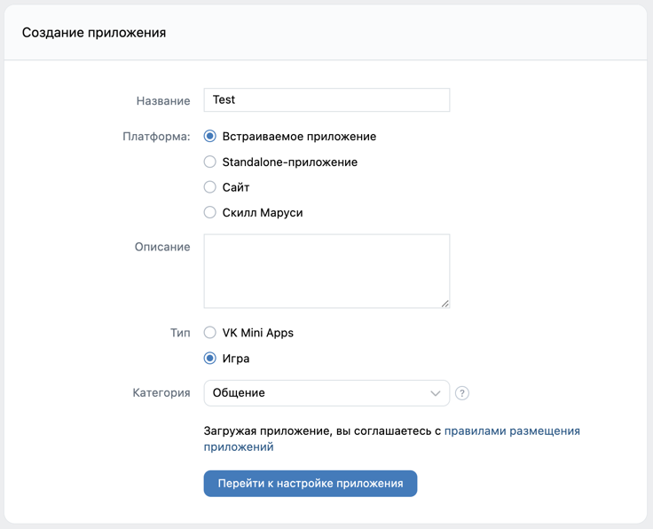

# find-pos-widgets

#### <div><a href="#en">🇬🇧 Eng</a> | <a href="#ru">Рус 🇷🇺</a></div>

<details>
  <summary>Table of contents</summary>
  <ol>
    <li>
      <a href="#en-about">About</a>
      <ul>
        <li><a href="#en-result-types">POS result types</a></li>
        <li><a href="#en-url-statuses">POS url statuses</a></li>
        <li><a href="#en-utm-conditions">UTM-code conditions</a></li>
      </ul>
    </li>
    <li>
      <a href="#en-deployment">Deployment</a>
      <ul>
        <li><a href="#en-windows">Windows</a></li>
        <li><a href="#en-linux-macos">Linux / MacOS</a></li>
      </ul>
    </li>
    <li>
      <a href="#en-configurations">Configurations</a>
      <ul>
        <li><a href="#en-vk-api">VK API</a></li>
        <li><a href="#en-parsing">Parsing</a></li>
        <li><a href="#en-progressbar">Progressbar</a></li>
        <li><a href="#en-display">Display</a></li>
        <li><a href="#en-exceptions">Exceptions</a></li>
      </ul>
    </li>
    <li>
      <a href="#en-widget-regexes">Widget url regexes</a>
    </li>
    <li>
      <a href="#en-requirements">Requirements</a>
    </li>
  </ol>
</details>

<a name="en-about"></a>

## About

Finds installed POS widgets on the public vk page and checks their URLs for compliance with templates with UTM tags.
<br/>The results are written to the file specified in the configuration file.

<a name="en-result-types"></a>

### POS result types

- `CORRECT` - Correct urls
- `INVALID` - Contain NOT valid urls
- `LINKS_COUNT` - Incorrect number of urls
- `MISSING` - Urls NOT exists
- `TIMEOUT` - Can't get public data from request, connection timeout
- `ERROR` - NOT valid public url or parsing errors

The console displays information about processed links:

```shell
Clearing resources ...
Reading file ...
Prepare publics from links ...
Number of links found: 3319
Start processing:
Processing: 100%|████████████| 3319/3319 [00:37<00:00, 88.23url/s, CORRECT=963, INVALID=1968, MISSING=388, TIMEOUT=0, ERROR=0]
Processing complete! See results in './result.xlsx'
```

<a name="en-url-statuses"></a>

### POS url statuses

- `VALID` - Correct url
- `NOT_MATCH` - Invalid, url don't match pattern
- `UTM_INVALID` - Invalid UTM code value
- `SPACER` - Invalid, url contains spaces
- `UNDEFINED` - Undefined POS url

<a name="en-utm-conditions"></a>

### Conditions for checking UTM-codes of POS url

Return a validation result `True` or `False`

- `ID`: Only digits
  ```regex
  \d+
  ```
- `REG-CODE`: Only 2 digits or one of the values: `111`, `711`, `7114`
   ```regex
   \d{2}|111|711|7114
   ```
- `MUN-CODE`: Only 8 digits
   ```regex
   \d{8}
   ```
- `OGRN`: Only 13 digits
   ```regex
   \d{13}
   ```
- `SOURCE`: Only one of the values: `vk`, `vk1`, `vk2`
   ```regex
   vk|vk1|vk2
   ```
- `UNDEFINED`: Undefined UTM-code

<a name="en-deployment"></a>

## Deployment

<a name="en-windows"></a>

### OS Windows

1. Go to the project directory
    ```shell
    cd find-pos-widgets
    ```

2. Create Python env
    ```shell
    python -m venv venv
    ```
3. Run env
    ```shell
    # for cmd.exe
    venv\Scripts\activate.bat
    ```
    ```shell
    # for PowerShell
    venv\Scripts\Activate.ps1
    ```

4. Upgrade pip (this command may be skipped)
    ```shell
    pip install --upgrade pip
    ```

5. Install requirements
    ```shell
    pip install -r requirements.txt
    ```

6. Start script
    ```shell
    python main.py
    ```

<a name="en-linux-macos"></a>

### OS Linux / MacOS

1. Go to the project directory
    ```bash
    cd find-pos-widgets
    ```
2. Create Python env
    ```bash
    python -m venv venv
    ```
3. Run env
    ```bash
    source venv\Scripts\activate
    ```
4. Upgrade pip (this command may be skipped)
    ```bash
    pip install --upgrade pip
    ```
5. Install requirements
    ```bash
    pip install -r requirements.txt
    ```
6. Start script
    ```bash
    python main.py
    ```

#### Stopping:

1. For stopping script use keys:
   <br/>`ctrl` + `c`
2. For close env use command:
   <br/>`deactivate`

<a name="en-configurations"></a>

## Configurations

Provided in [config.yaml](config.yaml) file:

```yaml
vk_api:
  access_token: 'Put your token'
  version: 5.131
parsing:
  max_links_per_widget: 2
  skip_correct: false
  save_public_data: true
  public_data_fields: [ menu, activity, city, contacts, description, members_count, status ]
progressbar:
  min_interval_per_unit: 0
display:
  csv_delimiter: ';'
  public_display_fields: [ pos_result, url, id, name, screen_name, pos_links, description ]
  show_utm_status: true
  codes_hints:
    pattern: '{is_valid} {param}={value} ({hint}, pattern: {pattern})'
    items:
      ID: 'Only digits'
      REG-CODE: 'Only 2 digits or one of the values: 111, 711, 7114'
      MUN-CODE: 'Only 8 digits'
      OGRN: 'Only 13 digits'
      SOURCE: 'Only one of the values: vk, vk1, vk2'
      UNDEFINED: 'Undefined UTM-code'
  status_types:
    pattern: '{name}'
    items:
      VALID: { name: '✅', value: 'Correct urls' }
      NOT_MATCH: { name: '❌', value: 'Invalid, url dont match pattern' }
      UTM_INVALID: { name: '⚠️', value: 'Invalid UTM code value' }
      SPACER: { name: '⚠️', value: 'Invalid, url contains spaces' }
      UNDEFINED: 'Undefined POS url'
  result_types:
    pattern: '{name}: {value}'
    items:
      CORRECT: { name: '✅', value: 'Correct urls' }
      INVALID: { name: '⚠️', value: 'Contain NOT valid urls' }
      LINKS_COUNT: { name: '❗', value: 'Widgets links count not pass tests' }
      MISSING: { name: '❌', value: 'Urls NOT exists' }
      TIMEOUT: { name: '⌛️', value: 'Timeout when getting url page data' }
      ERROR: { name: '🆘', value: 'NOT valid url or data parsing errors' }
paths:
  log_file: 'runtime.log'
  target_file: 'target.txt'
  result_file: 'result.xlsx'
  save_public_data_dir: 'publics_data'
exceptions:
  connection:
    max_tries: 5
    timeout: 5
```

<a name="en-vk-api"></a>

### VK API

|     Param      |   Type   | Default | Description                                                                                                                              |
|:--------------:|:--------:|:-------:|------------------------------------------------------------------------------------------------------------------------------------------|
|   `version`    | `float`  | `5.131` | VK API version                                                                                                                           |
| `access_token` | `string` |    -    | Your VK API token.<br/><br/>_For provide access_token you can [create app](https://vk.com/editapp?act=create) and get token in settings_ |

<details>
  <summary>(See screenshots)</summary>
  
  
</details>

<a name="en-parsing"></a>

### Parsing

|         Param          |   Type    | Default  | Description                                                                                                                                                                                                                                                                                                                                                                                                           |
|:----------------------:|:---------:|:--------:|-----------------------------------------------------------------------------------------------------------------------------------------------------------------------------------------------------------------------------------------------------------------------------------------------------------------------------------------------------------------------------------------------------------------------|
| `max_links_per_widget` | `intager` |   `2`    | Checking for the number of POS widgets, if `0` - the check is skipped                                                                                                                                                                                                                                                                                                                                                 |
|     `skip_correct`     | `boolean` | `false`  | Skip URLs with correct pos widgets                                                                                                                                                                                                                                                                                                                                                                                    |
|   `save_public_data`   | `boolean` |  `true`  | If we need to save datas of publics in folder                                                                                                                                                                                                                                                                                                                                                                         |
|  `public_data_fields`  |  `list`   | [`menu`] | Fields for request from VK API.<br/><br/>**Variables**:<br/><ul><li>`menu` - (Default) Widgets data</li><li>`activity` - Public activity type</li><li>`city` - City of the public</li><li>`description` - Public description</li><li>`members_count` - Public total members</li><li>`status` - Current public status</li><li>... find more fields in [dev.vk.com](https://dev.vk.com/method/groups.getById)</li></ul> |

<a name="en-progressbar"></a>

### Progressbar

|          Param          |   Type    | Default | Description                                                                                             |
|:-----------------------:|:---------:|:-------:|---------------------------------------------------------------------------------------------------------|
| `min_interval_per_unit` | `intager` |   `0`   | min_interval [`0`-`0.1`] for the update progress indicator<br/><br/>(_Do NOT increase more than `0.1`_) |

<a name="en-display"></a>

### Display

|                   Param                   |     Type     |                             Default                             | Description                                                                                                                                                                                                                                                                                                                                                                                                                                                                                                                                                                                                                                            |
|:-----------------------------------------:|:------------:|:---------------------------------------------------------------:|--------------------------------------------------------------------------------------------------------------------------------------------------------------------------------------------------------------------------------------------------------------------------------------------------------------------------------------------------------------------------------------------------------------------------------------------------------------------------------------------------------------------------------------------------------------------------------------------------------------------------------------------------------|
|              `csv_delimiter`              |   `string`   |                               `;`                               | Delimiter for result csv file                                                                                                                                                                                                                                                                                                                                                                                                                                                                                                                                                                                                                          |
|          `public_display_fields`          |    `list`    | [`pos_result`, `url`, `name`, `pos_links`, `id`, `screen_name`] | Select fields to display in result csv file (with the preservation of order)<br/><br/>**Variables**:<br/><ul><li>`pos_result` - (Default) POS widgets parsing result type</li><li>`url` - (Default) Target public url</li><li>`name` - (Default) Parsed public name</li><li>`pos_links` - (Default) POS links checking status</li><li>`id` - Parsed public id</li><li>`screen_name` - Parsed public screen_name</li><li>... include more from `parsing.public_data_fields`</li></ul>                                                                                                                                                                   |
|             `show_utm_status`             |  `boolean`   |                             `true`                              | Whether to show detailed error information in UTM-tags                                                                                                                                                                                                                                                                                                                                                                                                                                                                                                                                                                                                 |
|               `codes_hints`               | `dictionary` |                                -                                | Here you can specify the values to display in the pattern results file<br/><br/>Use variables and provide a `pattern` to determine how it will be provided<br/><br/>**Variables:**<br/>`code` - (string) Code designation<br/>`param` - (string) UTM-label<br/>`value` - (string) UTM-code value<br/>`pattern` - (string) Verification pattern<br/>`hint` - (string) Hint of expected value<br/>`is_valid` - (boolean) Validation result<br/><br/>**Example:**<br/><pre>pattern = "[{is_valid}] {param}={value} ({hint}, pattern: {pattern})"</pre>display: `True: utm_source='vk' ('Only one of the values: vk, vk1, vk2', pattern: 'vk1\|vk2\|vk3')` |
| `result_types`<br/>and<br/>`status_types` | `dictionary` |                                -                                | Here you can specify the values to display in the pattern results file<br/><br/>Use any variables, such as `name`, `value`, or others. Then provide a `pattern` to determine how it will be provided<br/><br/>**Example for `status_type`:**<br/><pre>{"name": "✅", "value": "Correct urls"}<br/>pattern = "{name}: {value}"</pre>display: `✅: Correct urls`                                                                                                                                                                                                                                                                                           |

##### Output result xlsx file example:

| pos_result | url                           |       id | name               | screen_name  | pos_url-0                                                                                          | pos_url_status-1 | url_utm_codes-1                                                                                                                                                                                                                                                                                                                                          | ... |
|:-----------|:------------------------------|---------:|:-------------------|:-------------|:---------------------------------------------------------------------------------------------------|:-----------------|:---------------------------------------------------------------------------------------------------------------------------------------------------------------------------------------------------------------------------------------------------------------------------------------------------------------------------------------------------------|-----|
| ✅          | https://vk.com/public12345678 | 12345678 | Name of the public | club12345678 | https://pos.gosuslugi.ru/form/?opaId=123456&utm_source=vk&utm_medium=11&utm_campaign=1234567890123 | ✅ Ок             | [True]() opaId='223186' (Only digits, pattern: '\\d+')<br/>[True]() utm_source='vk' (Only one of the values: vk, vk1, vk2, pattern: 'vk\|vk1\|vk2')<br/>[True]() utm_medium='44' (Only 2 digits or one of the values: 111, 711, 7114, pattern: '\\d{2}\|111\\|711\|7114')<br/>[True]() utm_campaign='1024900965088' (Only 13 digits, pattern: '\\d{13}') | ... |
| ❌          | https://vk.com/best_public    | 87654321 | Best public ever   | best_public  |                                                                                                    |                  |                                                                                                                                                                                                                                                                                                                                                          | ... |

<a name="en-paths"></a>

### Paths

|         Param          | Type     |    Default     | Description                                                                                                                                                      |
|:----------------------:|----------|:--------------:|------------------------------------------------------------------------------------------------------------------------------------------------------------------|
|       `log_file`       | `string` | `runtime.log`  | Path to runtime log file                                                                                                                                         |
|     `target_file`      | `string` |  `target.txt`  | Path to target file with urls                                                                                                                                    |
|     `result_file`      | `string` | `result.xlsx`  | Path to result file, default file format is `xlsx`.<br/><br/>_Available formats: `csv`, `xlsx`, `json`, `html`._                                                 |
| `save_public_data_dir` | `string` | `publics_data` | The path to the directory when saving the parsed data of the VK group to a JSON file<br/><br/>_If `parsing.save_public_data` is `false` - data don't been saved_ |

<a name="en-exceptions"></a>

### Exceptions

|    Param    | Type      | Default | Description                                                              |  
|:-----------:|-----------|:-------:|--------------------------------------------------------------------------|  
| `max_tries` | `intager` |   `5`   | Number of attempts to get data                                           |  
|  `timeout`  | `float`   |   `5`   | Waiting between attempts<br/>_(multiplied by the number of `max_tries`)_ |  

<a name="en-widget-regexes"></a>

## Widget url regexes

#### Not provided UTM codes

```regexp
REG-CODE|OGRN|ID|MUN-CODE
```

#### Spacers

```regexp
\s|%20
```

#### Template

```regexp
https://pos\.gosuslugi\.ru/(?:form/\?(opaId=\d+)|og/org-activities\?(?:(reg_code=\d{2,8})|(mun_code=\d{8})))&(utm_source=vk|utm_source=vk[12])&(utm_medium=\d{2,4})&(utm_campaign=\d{13})
```

<a name="en-requirements"></a>

## Requirements

1. Python 3.8+
2. Installed python env [requirements](requirements.txt)
    ```
    omegaconf==2.3.0
    tqdm==4.65.0
    vk==3.0
    openpyxl==3.1.2
    pandas~=2.0.2
    requests~=2.31.0
    ```

---

<a name="ru"></a>

# find-pos-widgets

#### <div><a href="#en">🇬🇧 Eng</a> | <a href="#ru">Рус 🇷🇺</a></div>

<details>
  <summary>Оглавление</summary>
  <ol>
    <li>
      <a href="#ru-about">Описание</a>
      <ul>
        <li><a href="#ru-result-types">Типы результатов POS</a></li>
        <li><a href="#ru-url-statuses">Статусы URL POS</a></li>
        <li><a href="#ru-utm-conditions">Условия проверки UTM-кода POS</a></li>
      </ul>
    </li>
    <li>
      <a href="#ru-deployment">Развертывание</a>
      <ul>
        <li><a href="#ru-windows">Windows</a></li>
        <li><a href="#ru-linux-macos">Linux / MacOS</a></li>
      </ul>
    </li>
    <li>
      <a href="#ru-configurations">Конфигурации</a>
      <ul>
        <li><a href="#ru-vk-api">VK API</a></li>
        <li><a href="#ru-parsing">Парсинг</a></li>
        <li><a href="#ru-progressbar">Прогрессбар</a></li>
        <li><a href="#ru-display">Вывод</a></li>
        <li><a href="#ru-exceptions">Исключения</a></li>
      </ul>
    </li>
    <li>
      <a href="#ru-widget-regexes">Регулярные выражения URL виджетов</a>
    </li>
    <li>
      <a href="#ru-requirements">Требования</a>
    </li>
  </ol>
</details>


<a name="ru-about"></a>

## Описание

Находит установленные виджеты POS на общедоступной странице ВКонтакте и проверяет их URL-адреса на соответствие шаблонам
с метками UTM.
<br/>Результаты записываются в файл, указанный в файле конфигурации.

<a name="ru-result-types"></a>

### Типы результатов POS

- `CORRECT` - Правильные URL-адреса
- `INVALID` - Содержат неправильные URL-адреса
- `LINKS_COUNT` - Неверное количество URL-адресов
- `MISSING` - URL-адреса отсутствуют
- `TIMEOUT` - Невозможно получить публичные данные из запроса, истекло время ожидания соединения
- `ERROR` - Неправильный публичный URL или ошибка обработки полученных данных

В консоли отображается прогрессбар с информацией о ходе выполнения программы:

```shell
Clearing resources ...
Reading file ...
Prepare publics from links ...
Number of links found: 3319
Start processing:
Processing: 100%|████████████| 3319/3319 [00:37<00:00, 88.23url/s, CORRECT=963, INVALID=1968, MISSING=388, TIMEOUT=0, ERROR=0]
Processing complete! See results in './result.xlsx'
```

<a name="ru-url-statuses"></a>

### Статусы URL-адресов

- `VALID` - Правильный URL-адрес
- `NOT_MATCH` - Неверный URL-адрес, не соответствует шаблону
- `UTM_INVALID` - Неверное значение кода UTM
- `SPACER` - Неверный URL-адрес, содержит пробелы

<a name="ru-utm-conditions"></a>

### Условия для проверки UTM-кодов POS ссылки

Возвращает результат проверки `True` (пройдена) или `False` (НЕ пройдена)

- `ID`: Только цифры
  ```regex
  \d+
  ```
- `REG-CODE`: Только 2 цифры или одно из значений: `111`, `711`, `7114`
   ```regex
   \d{2}|111|711|7114
   ```
- `MUN-CODE`: Только 8 цифр
   ```regex
   \d{8}
   ```
- `OGRN`: Только 13 цифр
   ```regex
   \d{13}
   ```
- `SOURCE`: Только одно из значений: `vk`, `vk1`, `vk2`
   ```regex
   vk|vk1|vk2
   ```
- `UNDEFINED`: Неизвестный UTM-код

<a name="ru-deployment"></a>

## Развертывание

<a name="ru-windows"></a>

### ОС Windows

1. Перейдите в директорию проекта
    ```shell
    cd find-pos-widgets
    ```

2. Создайте Python-окружение
    ```shell
    python -m venv venv
    ```
3. Активируйте окружение
    ```shell
    # для cmd.exe
    venv\Scripts\activate.bat
    ```
    ```shell
    # для PowerShell
    venv\Scripts\Activate.ps1
    ```

4. Обновите pip (эту команду можно пропустить)
    ```shell
    pip install --upgrade pip
    ```

5. Установите зависимости
    ```shell
    pip install -r requirements.txt
    ```

6. Запустите скрипт
    ```shell
    python main.py
    ```

<a name="ru-linux-macos"></a>

### ОС Linux / MacOS

1. Перейдите в директорию проекта
    ```bash
    cd find-pos-widgets
    ```
2. Создайте Python-окружение
    ```bash
    python -m venv venv
    ```
3. Активируйте окружение
    ```bash
    source venv\Scripts\activate
    ```
4. Обновите pip (эту команду можно пропустить)
    ```bash
    pip install --upgrade pip
    ```
5. Установите зависимости
    ```bash
    pip install -r requirements.txt
    ```
6. Запустите скрипт
    ```bash
    python main.py
    ```

#### Остановка:

1. Для остановки скрипта используйте сочетание клавиш:
   <br/>`ctrl` + `c`
2. Для закрытия окружения используйте команду:
   <br/>`deactivate`

<a name="ru-configurations"></a>

## Конфигурации

Определены в [config.yaml](config.yaml) файле:

```yaml
vk_api:
  access_token: 'Ваш токен здесь'
  version: 5.131
parsing:
  max_links_per_widget: 2
  skip_correct: false
  save_public_data: true
  public_data_fields: [ menu, activity, city, contacts, description, members_count, status ]
progressbar:
  min_interval_per_unit: 0
display:
  csv_delimiter: ';'
  public_display_fields: [ pos_result, url, id, name, screen_name, pos_links, description ]
  show_utm_status: true
  codes_hints:
    pattern: '{is_valid} {param}={value} ({hint}, шаблон: {pattern})'
    items:
      ID: 'Только цифры'
      REG-CODE: 'Только 2 цифры или одно из значений: 111, 711, 7114'
      MUN-CODE: 'Только 8 цифр'
      OGRN: 'Только 13 цифр'
      SOURCE: 'Только одно из значений: vk, vk1, vk2'
      UNDEFINED: 'Неизвестный UTM-код'
  status_types:
    pattern: '{name}'
    items:
      VALID: { name: '✅', value: 'Правильный URL-адрес' }
      NOT_MATCH: { name: '❌', value: 'Неверный URL-адрес, не соответствует шаблону' }
      UTM_INVALID: { name: '⚠️', value: 'Неверное значение кода UTM' }
      SPACER: { name: '⚠️', value: 'Неверный URL-адрес, содержит пробелы' }
      UNDEFINED: { name: '❗', value: 'Ссылка не является POS'}
  result_types:
    pattern: '{name}: {value}'
    items:
      CORRECT: { name: '✅', value: 'Правильные URL-адреса' }
      INVALID: { name: '⚠️', value: 'Содержат неправильные URL-адреса' }
      LINKS_COUNT: { name: '❗', value: 'Неверное количество URL-адресов' }
      MISSING: { name: '❌', value: 'URL-адреса отсутствуют' }
      TIMEOUT: { name: '⌛️', value: 'Невозможно получить публичные данные из запроса, истекло время ожидания соединения' }
      ERROR: { name: '🆘', value: 'Неправильный публичный URL или ошибка обработки полученных данных' }
paths:
  log_file: 'runtime.log'
  target_file: 'target.txt'
  result_file: 'result.xlsx'
  save_public_data_dir: 'publics_data'
exceptions:
  connection:
    max_tries: 5
    timeout: 5
```

<a name="ru-vk-api"></a>

### VK API

|    Параметр    |   Тип    | Значение по умолчанию | Описание                                                                                                                                                      |
|:--------------:|:--------:|:---------------------:|---------------------------------------------------------------------------------------------------------------------------------------------------------------|
|   `version`    | `float`  |        `5.131`        | Версия VK API                                                                                                                                                 |
| `access_token` | `string` |           -           | Ваш токен VK API.<br/><br/>_Чтобы предоставить access_token, вы можете [создать приложение](https://vk.com/editapp?act=create) и получить токен в настройках_ |

<details>
  <summary>(См. скриншоты)</summary>
  
  
</details>

<a name="ru-parsing"></a>

### Парсинг

|        Параметр        |    Тип    | Значение по умолчанию | Описание                                                                                                                                                                                                                                                                                                                                                                                                                                                                                             |
|:----------------------:|:---------:|:---------------------:|------------------------------------------------------------------------------------------------------------------------------------------------------------------------------------------------------------------------------------------------------------------------------------------------------------------------------------------------------------------------------------------------------------------------------------------------------------------------------------------------------|
| `max_links_per_widget` | `intager` |          `2`          | Проверка количества POS-виджетов, если `0` - проверка пропускается                                                                                                                                                                                                                                                                                                                                                                                                                                   |
|     `skip_correct`     | `boolean` |        `false`        | Пропустить URL-адреса с правильными POS-виджетами                                                                                                                                                                                                                                                                                                                                                                                                                                                    |
|   `save_public_data`   | `boolean` |        `true`         | Если нам нужно сохранить данные об общественных страницах в папке                                                                                                                                                                                                                                                                                                                                                                                                                                    |
|  `public_data_fields`  |  `list`   |       [`menu`]        | Поля для запроса из VK API.<br/><br/>**Переменные**:<br/><ul><li>`menu` - данные виджетов</li><li>`activity` - тип активности общественной страницы</li><li>`city` - город общественной страницы</li><li>`description` - описание общественной страницы</li><li>`members_count` - общее количество участников общественной страницы</li><li>`status` - текущий статус общественной страницы</li><li>... больше полей можно найти на [dev.vk.com](https://dev.vk.com/method/groups.getById)</li></ul> |

<a name="ru-progressbar"></a>

### Прогрессбар

|        Параметр         |    Тип    | Значение по умолчанию | Описание                                                                                                      |
|:-----------------------:|:---------:|:---------------------:|---------------------------------------------------------------------------------------------------------------|
| `min_interval_per_unit` | `intager` |          `0`          | Минимальный интервал [`0`-`0.1`] для обновления индикатора прогресса<br/><br/>(_Не увеличивайте более `0.1`_) |

<a name="ru-display"></a>

### Дисплей

|                 Параметр                  |     Тип      |                      Значение по умолчанию                      | Описание                                                                                                                                                                                                                                                                                                                                                                                                                                                                                                                                                        |
|:-----------------------------------------:|:------------:|:---------------------------------------------------------------:|-----------------------------------------------------------------------------------------------------------------------------------------------------------------------------------------------------------------------------------------------------------------------------------------------------------------------------------------------------------------------------------------------------------------------------------------------------------------------------------------------------------------------------------------------------------------|
|              `csv_delimiter`              |   `string`   |                               `;`                               | Разделитель для файла результатов в формате CSV                                                                                                                                                                                                                                                                                                                                                                                                                                                                                                                 |
|          `public_display_fields`          |    `list`    | [`pos_result`, `url`, `name`, `pos_links`, `id`, `screen_name`] | Выберите поля для отображения в файле результатов (они будут отображены в том же порядке)<br/><br/>**Переменные**:<br/><ul><li>`pos_result` - тип результата анализа виджета POS</li><li>`url` - целевой общедоступный URL</li><li>`name` - разобранное имя общедоступного ресурса</li><li>`pos_links` - статус проверки ссылок POS</li><li>`id` - разобранный идентификатор общедоступного ресурса</li><li>`screen_name` - разобранное имя общедоступного ресурса</li><li>... добавьте больше из <a href="ru-parsing">parsing.public_data_fields</a></li></ul> |
| `result_types`<br/>and<br/>`status_types` | `dictionary` |                                -                                | Здесь вы можете указать значения для отображения в файле результатов в формате шаблона<br/><br/>Используйте любые переменные, такие как `name`, `value` или другие. Затем укажите `pattern`, чтобы определить, как они будут предоставлены<br/><br/>**Пример для `status_type`:**<br/><pre>{"name": "✅", "value": "Правильные URL-адреса"}<br/>pattern = "{name}: {value}"</pre>будет представлено как: `✅: Правильные URL-адреса                                                                                                                               |

##### Пример файла результата в формате XLSX:

  | pos_result | url                           |       id | name                | screen_name  | pos_url-0                                                                                          | pos_url_status-1 | url_utm_codes-1                                                                                                                                                                                                                                                                                                                                         | ... |
|:-----------|:------------------------------|---------:|:--------------------|:-------------|:---------------------------------------------------------------------------------------------------|:-----------------|:--------------------------------------------------------------------------------------------------------------------------------------------------------------------------------------------------------------------------------------------------------------------------------------------------------------------------------------------------------|-----|
| ✅          | https://vk.com/public12345678 | 12345678 | Имя паблика         | club12345678 | https://pos.gosuslugi.ru/form/?opaId=123456&utm_source=vk&utm_medium=11&utm_campaign=1234567890123 | ✅ Ок             | [True]() opaId='223186' (Только цифры, шаблон: '\\d+')<br/>[True]() utm_source='vk' (Только одно из значений: vk, vk1, vk2, шаблон: 'vk\|vk1\|vk2')<br/>[True]() utm_medium='44' (Только 2 цифры или одно из значений: 111, 711, 7114, шаблон: '\\d{2}\|111\\|711\|7114')<br/>[True]() utm_campaign='1024900965088' (Только 13 цифр, шаблон: '\\d{13}') | ... |
| ❌          | https://vk.com/best_public    | 87654321 | Самый лучший паблик | best_public  |                                                                                                    |                  |                                                                                                                                                                                                                                                                                                                                                         | ... |

<a name="ru-paths"></a>

### Пути

|        Параметр        |   Тип    | Значение по умолчанию | Описание                                                                                                                                                                                   |
|:----------------------:|:--------:|:---------------------:|--------------------------------------------------------------------------------------------------------------------------------------------------------------------------------------------|
|       `log_file`       | `string` |     `runtime.log`     | Путь к файлу журнала выполнения                                                                                                                                                            |
|     `target_file`      | `string` |     `target.txt`      | Путь к файлу с целевыми URL-адресами                                                                                                                                                       |
|     `result_file`      | `string` |     `result.xlsx`      | Путь к файлу с результатами, формат по-умолчанию `xlsx`.<br/><br/>_Доступные форматы: `csv`, `xlsx`, `json`, `html`._                                                                      |
| `save_public_data_dir` | `string` |    `publics_data`     | Путь к каталогу, в котором сохраняются разобранные данные группы VK в формате JSON<br/><br/>_Если <a href="#ru-parsing">parsing.save_public_data</a> равно `false`, данные не сохраняются_ |

<a name="ru-exceptions"></a>

### Исключения

|  Параметр   |    Тип    | Значение по умолчанию | Описание                                                              |  
|:-----------:|:---------:|:---------------------:|-----------------------------------------------------------------------|  
| `max_tries` | `intager` |          `5`          | Количество попыток получения данных                                   |  
|  `timeout`  |  `float`  |         `5.`          | Ожидание между попытками<br/>_(умножается на количество `max_tries`)_ |  

<a name="ru-widget-regexes"></a>

## Регулярные выражения URL-адресов виджетов

#### Не предоставленные коды UTM

```regexp
REG-CODE|OGRN|ID|MUN-CODE
```

#### Разделители

```regexp
\s|%20
```

#### Шаблон

```regexp
https://pos\.gosuslugi\.ru/(?:form/\?(opaId=\d+)|og/org-activities\?(?:(reg_code=\d{2,8})|(mun_code=\d{8})))&(utm_source=vk|utm_source=vk[12])&(utm_medium=\d{2,4})&(utm_campaign=\d{13})
```

<a name="ru-requirements"></a>

## Требования

1. Python 3.8+
2. Установлены зависимости python [requirements](requirements.txt)
    ```
    omegaconf==2.3.0
    tqdm==4.65.0
    vk==3.0
    openpyxl==3.1.2
    pandas~=2.0.2
    requests~=2.31.0
    ```
